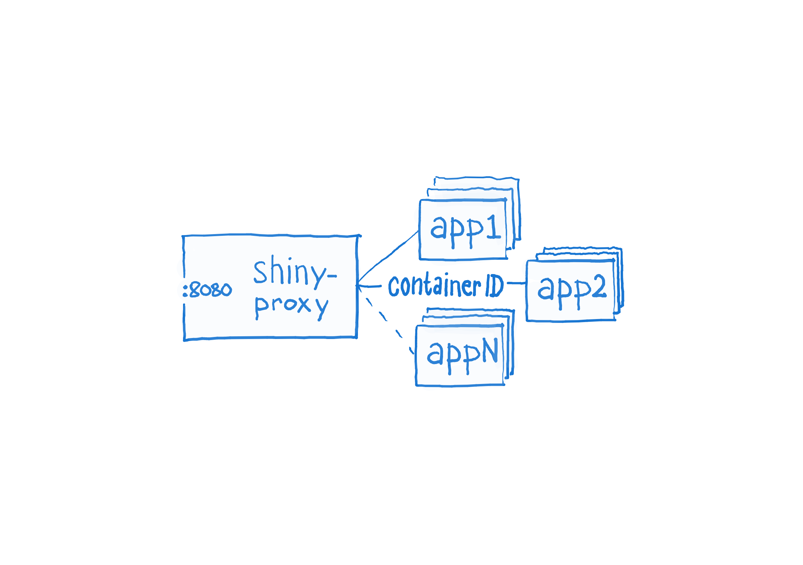

# Proxy our shiny apps

## Introduction
Re-using the name of [the underlying Spring boot web application](https://www.shinyproxy.io/) _shinyproxy_ is the deployer of shiny web applications developed and mentained by SKDE. Both _shinyserver_ and the web applications it it a proxy for are deployed as [docker containers](https://www.yr.no/place/Norway/Troms_og_Finnmark/Troms%C3%B8/Troms%C3%B8/hour_by_hour.html) and replicated at a given number of nodes to reduce potential downtime.



_shinyproxy_ is part of the [infrastructure at mongr.no](https://github.com/SKDE-Felles/lb-rp) and serves shiny applications such as [qmongr](https://github.com/SKDE-Felles/qmongr).

## Config
Configuration of _shinyproxy_ is defined in the _application.yml_-file. Re-configuration will in most likely occur as a result of new shiny application being added (or old ones removed). For details please see [the ShinyProxy docs](https://www.shinyproxy.io/configuration/)

## Install
All steps are performed from the command line at each server instance (node) that will be running _shinyproxy_.

### First time
Make sure that the current content of this repo is available by using git:
```
git clone https://SKDE-Felles/shinyproxy.git
```

If the server to be hosting _shinyproxy_ is just created (vanilla state) make sure _docker-ce_ and _docker-compose_ are installed along with other relevant settings. Move into the newly created _shinyproxy_directory and run the following script:
```
sudo ./install.sh
```

Repeat the above instructions at all nodes.

### Update
Please note that an update of the _shinyproxy_ will render all shiny applications behind it inaccessible. Therefore, make sure to perform all the following steps one node at a time. This will make sure that while one node is down for an update the other nodes will still serve users of the shiny applications. 

First, make sure to download the latest updates from this repository. Move into the _shinyproxy_ directory and run
```
git pull origin master
```
In fact, this step is only needed upon chenges in the _docker-compose.yml_-file.

Then, take down _shinyproxy_ docker container:
```
docker-compose down
```
and download the updated _shinyproxy_ image:
```
docker pull hnskde/shinyproxy
```

Clean up old images and containers:
```
docker system prune
```
and bring up the updated _shinyproxy_ container:
```
docker-compose up -d
```

Repeat the above steps on all nodes.

## Start and stop service
To enable _shinyproxy_ use _docker-compose_ to start the relevant services in detached mode. Move into the _shinyproxy_ directory and run:
```
docker-compose up -d
```

To stop it do:
```
docker-compose down
```

To bring the services down an up again in one go do:
```
docker-compose restart
```

For other options please consult [the docker compose docs](https://docs.docker.com/compose/).

## Note on updating shiny applications
Updating the shiny applications is a somewhat different process and part of a continuous integration and delivery (ci/cd) scheme. When starting _shinyproxy_ docker container as described above a second service, [watchtower](https://containrrr.github.io/watchtower/), is also started. This service regularly poll for newer images for running shiny app containers tagged for such updates. If updates are found the corresponding images are downloaded. A new version of a shiny application will be available once _shinyproxy_ restarts the corresonding container from the updated image. 
